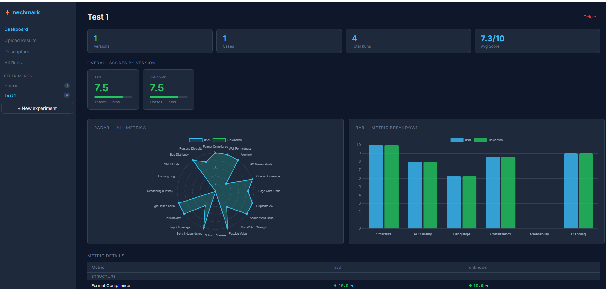
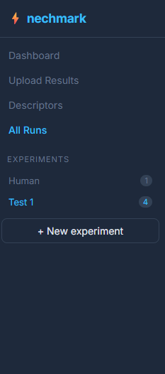
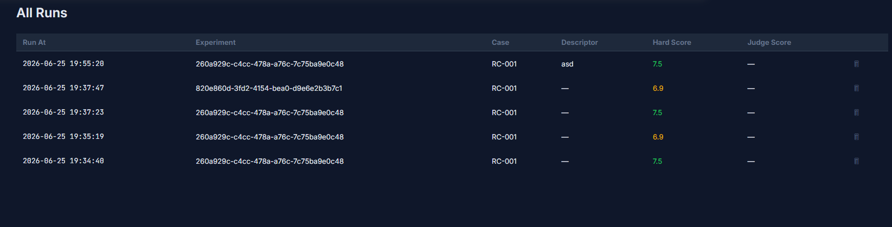

# nechmark

[](https://github.com/LordIllidan/nechmark/actions/workflows/ci.yml)
[](https://github.com/LordIllidan/nechmark/releases/latest)
[](https://nodejs.org)
[](https://www.typescriptlang.org)
[](LICENSE)

Benchmarking and quality assurance system for AI-generated BA artifacts — user stories, acceptance criteria, and epics.

Supports two evaluation modes that complement each other:

- **LLM-as-Judge** — a separate model scores output across 6 quality dimensions
- **Hard Metrics** — 20 deterministic, math-based metrics computed without any LLM; same input always produces same score

Use both modes together for a complete picture, or use hard metrics alone for fast, free, offline evaluation.

---

## Quick start

```bash
git clone https://github.com/LordIllidan/nechmark.git
cd nechmark
npm install
export ANTHROPIC_API_KEY=sk-ant-...
```

### Generate + evaluate one requirement

```bash
npx ts-node src/index.ts
```

### Run regression benchmark suite

```bash
npx ts-node src/bench/runner.ts
# Saves results to results/bench-<uuid>.json
```

### Compare AI agent vs human analyst

```bash
# human.json = { "userStories": [...] } written manually
npx ts-node src/compare-cli.ts \
  --ai   results/ai-output.json \
  --human results/human.json \
  --input requirement.txt \
  --labels "Agent,Analityk"
```

---

## Screenshots

### Dashboard — score comparison across agent versions


### Upload Results & Descriptors menu


### New Descriptor form


### All Runs table


---

## Hard metrics — complete reference

All 20 metrics are deterministic (no LLM, no randomness, no network). Each returns a **score 0–10** and a raw value. Scores are combined into a weighted overall score.

### Group 1 — Structure & Format

#### Format Compliance
**What:** Percentage of user stories with all required fields populated: `asA`, `iWant`, `soThat`, `title`, and at least one acceptance criterion.

**Formula:** `compliant_stories / total_stories × 10`

**Target:** 10/10 (100%). Any missing field is a hard defect.

**Why it matters:** Incomplete stories block estimation, testing, and sprint planning. The most common shortcut humans take under time pressure.

**Weight:** 1.5×

---

#### Well-Formedness (QUS)
**What:** Structural quality of the "As a / I want / So that" template per the [QUS Framework](https://link.springer.com/article/10.1007/s00766-016-0250-x). Flags: missing role, too-short goal/benefit, or `soThat` that semantically mirrors `iWant` (no distinct business value added).

**Formula:** `well_formed_stories / total_stories × 10`

**Similarity check:** cosine similarity between `iWant` and `soThat` token vectors — if > 0.8, the benefit adds no new information.

**Target:** 10/10.

**Why it matters:** "So that I can use the feature" is not a benefit. A well-formed story must express *why* the user wants this, not just repeat *what*.

**Weight:** 1.5×

---

#### Atomicity (QUS)
**What:** Percentage of stories that address exactly one feature (atomic). Flags stories whose `iWant` field contains multi-action conjunctions (`and also`, `as well as`, `in addition to`) or stories with > 12 acceptance criteria (proxy for over-scoped story).

**Formula:** `atomic_stories / total_stories × 10`

**Target:** 10/10. Each story = one deliverable.

**Why it matters:** Non-atomic stories cannot be independently estimated or delivered. INVEST principle I (Independent) and S (Small).

**Weight:** 1.5×

---

### Group 2 — Acceptance Criteria Quality

#### AC Measurability
**What:** Percentage of acceptance criteria that contain at least one quantifiable assertion: a number with a unit, a comparison operator, or a threshold expression.

**Detection patterns (regex):**
- Numbers with units: `\d+(ms|sec|%|kb|mb|...)`
- Comparisons: `< 500ms`, `>= 3 attempts`
- Threshold words: `at least 5`, `no more than 10`, `exactly 1`

**Formula:** `measurable_AC / total_AC × 10`

**Target:** > 7/10. Some AC (UI layout, labels) legitimately lack numbers.

**Why it matters:** "The system shall respond quickly" cannot be tested. "The system shall respond in < 2 seconds" can.

**Weight:** 1.5×

---

#### Gherkin Coverage
**What:** Percentage of acceptance criteria written in Given/When/Then (BDD) format.

**Detection:** Regex for `given...when...then` or any line starting with `Given`, `When`, or `Then`.

**Formula:** `gherkin_AC / total_AC × 10`

**Target:** Context-dependent. Teams using BDD automation should aim for 10/10.

**Why it matters:** Gherkin AC are executable by test automation tools (Cucumber, Behave). Non-Gherkin AC require manual interpretation and are harder to automate.

**Weight:** 1.0×

---

#### Edge Case Ratio
**What:** Percentage of AC that cover error paths, limits, and boundary conditions.

**Detection:** `type === "edge_case"` OR keywords: `error`, `fail`, `invalid`, `empty`, `null`, `timeout`, `exceed`, `limit`, `unauthorized`, `forbidden`, `not found`, `duplicate`, `conflict`.

**Formula:** Score 10 at 25% edge-case ratio, degrades in both directions.

**Target:** 20–35% of all AC should be edge cases.

**Why it matters:** Agents and junior analysts write happy-path AC first and forget edge cases. < 15% is a red flag for test coverage gaps.

**Weight:** 1.0×

---

#### Duplicate AC
**What:** Cosine similarity between all pairs of acceptance criteria across the entire output. Pairs with similarity > 0.75 are flagged as duplicates.

**Formula:** `1 - duplicate_pair_ratio`, where `duplicate_pair_ratio = duplicate_pairs / total_possible_pairs`

**Target:** 10/10 (zero duplicates).

**Why it matters:** Duplicate AC inflate story size estimates and cause redundant test cases. Common when stories are generated from templates.

**Weight:** 1.0×

---

### Group 3 — Readability

#### Readability — Flesch Reading Ease
**What:** Classic readability formula. Scores 0–100 based on average sentence length and average syllables per word.

**Formula:** `FRE = 206.835 − 1.015 × ASL − 84.6 × ASW`
- `ASL` = words / sentences
- `ASW` = syllables / words

**Score mapping:** Target 50–70 for professional BA documents. Score 10 at FRE = 60, degrades linearly.

**Interpretation:** 70–100 = very easy; 50–70 = standard; 30–50 = difficult; < 30 = academic.

**Weight:** 0.5×

---

#### Gunning Fog Index
**What:** Readability metric that penalizes complex words (3+ syllables). Outputs grade level (years of education needed).

**Formula:** `GFI = 0.4 × (ASL + 100 × complex_word_ratio)`
- Complex words = words with 3+ syllables

**Target:** 6–10 grade level for BA docs. Score 10 at GFI = 8.

**Why it matters:** Catches jargon and unnecessarily long words that inflate sentence complexity beyond what Flesch detects.

**Weight:** 0.5×

---

#### SMOG Index
**What:** Simplified Measure of Gobbledygook. Focuses on polysyllabic words (3+ syllables) as proxy for comprehension difficulty.

**Formula:** `SMOG = √(1.043 × (30 × polysyllables / sentences) + 3.1291)`

**Target:** 8–12. Score 10 at SMOG = 10.

**Why it matters:** SMOG is more sensitive to polysyllabic words than Flesch and Fog. Useful for detecting overly technical language hidden in longer sentences.

**Weight:** 0.5×

---

### Group 4 — Language Precision

#### Vague Word Ratio
**What:** Percentage of total words that are vague, subjective, or unmeasurable.

**Vague word dictionary (50+ terms):** `easy`, `fast`, `quickly`, `simple`, `user-friendly`, `smooth`, `reliable`, `robust`, `flexible`, `scalable`, `efficient`, `effective`, `seamlessly`, `intuitively`, `appropriate`, `reasonable`, `sufficient`, `good`, `various`, `several`, `large`, `small`, `approximately`, `about`, `roughly`, etc.

**Formula:** `vague_words / total_words`

**Score:** 10 at 0%, degrades to 0 at 5%+.

**Why it matters:** Every vague word in an AC is an implicit argument waiting to happen in UAT. "The page should load fast" — what is fast?

**Source:** [Brainly Requirements Analysis](https://brainly.com/question/50408008), [ZenoSoftware Language Standards](https://zenofsoftware.com/posts/requirement_language/)

**Weight:** 1.5×

---

#### Modal Verb Strength
**What:** Distribution of obligation levels across modal verbs in the output.

**Classes:**
- **Mandatory** (`must`, `shall`): absolute requirement — must be tested
- **Recommended** (`should`): expected but negotiable
- **Optional** (`may`, `can`, `could`, `might`): capability, not required

**Formula:** `mandatory_ratio = mandatory_count / (mandatory + recommended + optional)`

**Target:** Mandatory ratio ≥ 0.6. Score = `mandatory_ratio × 10`.

**Why it matters:** "The system should validate input" is ambiguous. "The system must validate input" is a contract. Mixed modals in AC cause disputes about what constitutes a defect.

**Source:** [IEEE modal verb standards](https://helpcenter.veeam.com/docs/styleguide/tw/modal_verbs.html), [Requirements language](https://zenofsoftware.com/posts/requirement_language/)

**Weight:** 1.0×

---

#### Passive Voice Ratio
**What:** Percentage of sentences in acceptance criteria written in passive voice.

**Detection:** Regex pattern `(is|are|was|were|been|be|being) + past_participle(-ed/-en)`.

**Formula:** `passive_sentences / total_sentences`

**Target:** < 10% passive. Score 10 at 0%, degrades to 0 at 20%+.

**Why it matters:** Passive voice hides the actor. "Data shall be validated" — validated by whom? The system? The user? A third-party service? Active voice makes responsibility explicit.

**Weight:** 0.8×

---

#### Subordinate Clause Density
**What:** Percentage of AC sentences containing subordinate clauses introduced by conjunctions: `when`, `if`, `because`, `although`, `since`, `while`, `unless`, `after`, `before`, `until`, `as`, `though`, `even if`, `even though`, `so that`, `provided that`, `given that`, etc.

**Formula:** `sentences_with_subordinate_clause / total_sentences`

**Target:** < 30%. Score 10 at ≤ 30%, degrades above.

**Why it matters:** "When the user is logged in and the session has not expired and the feature flag is enabled, the system should display the dashboard" — each nested clause multiplies interpretation complexity. Simple sentences reduce misunderstandings.

**Source:** [Syntactic complexity research](https://arxiv.org/pdf/1806.11099)

**Weight:** 0.8×

---

### Group 5 — Consistency & Coverage

#### Story Independence
**What:** Cosine similarity between pairs of user stories (bag-of-words over all story fields and AC). Measures how much stories overlap in vocabulary and meaning.

**Formula:** `1 − avg_pairwise_similarity`, score capped at 10.

**Flags:** Pairs with similarity > 0.6.

**Target:** Score > 7/10.

**Why it matters:** INVEST principle I (Independent). Overlapping stories create planning conflicts, unclear ownership, and double-counting in velocity.

**Weight:** 1.0×

---

#### Input Coverage
**What:** Percentage of "significant" input keywords (length > 4, not stop words) that appear somewhere in the generated output.

**Formula:** `covered_keywords / total_input_keywords × 10`

**Target:** > 8/10. Some input noise is expected.

**Why it matters:** The most critical hard metric for AI vs. human comparison. An agent that ignores requirements silently is dangerous. This catches hallucinated completeness.

**Weight:** 2.0× _(highest weight)_

---

#### Terminology Consistency
**What:** Detects synonym groups used interchangeably across stories — e.g., `user` vs. `customer` vs. `client`, or `error` vs. `issue` vs. `failure`. Inconsistent terminology breaks traceability and causes team miscommunication.

**Detection:** Regex matching across 10 predefined synonym groups covering the most common BA domain conflations.

**Formula:** Score = `max(0, 10 − inconsistent_groups × 1.5)`

**Target:** 0 inconsistent groups = 10/10.

**Source:** [Terminology consistency](https://aktru.eu/terminology-consistency/), [HHI-based measurement](https://www.mdpi.com/2078-2489/13/2/43)

**Weight:** 1.5×

---

#### Type-Token Ratio (Lexical Diversity)
**What:** Ratio of unique words to total words in the output. Measures vocabulary richness.

**Formula:** `TTR = unique_words / total_words`

**Target:** 0.4–0.6.
- TTR < 0.3 = monotonous, repetitive language
- TTR 0.4–0.6 = good balance
- TTR > 0.7 = over-varied vocabulary (synonym inconsistency risk)

**Why it matters:** Complements Terminology Consistency. High TTR can flag that synonyms are being used interchangeably for the same concept. Low TTR means the text is formulaic.

**Source:** [Type-Token Ratio research](https://www.researchgate.net/publication/393146462_Type-Token_Ratio_TTR_-_A_Measure_of_Lexical_Diversity)

**Weight:** 0.8×

---

### Group 6 — Planning & Estimation

#### Size Distribution
**What:** Variance of story point estimates across all stories with assigned points.

**Formula:** `variance = Σ(points_i − mean)² / n`

**Target:** Variance 3–12 (healthy spread across point values). Score 10 in range, degrades outside.
- Variance near 0 = all stories same size (suspicious — likely not truly sized)
- Very high variance = mixed-granularity epics and tasks in same set

**Why it matters:** A well-decomposed story set should have varied sizes. When an AI assigns 3 points to everything, it signals it doesn't understand scope differentiation.

**Weight:** 0.5×

---

#### Persona Diversity
**What:** Ratio of unique user personas to total stories.

**Formula:** `unique_personas / total_stories`

**Target:** 0.25–0.6. Score 10 in range.
- Ratio < 0.1 = only one persona for everything (oversimplified)
- Ratio > 0.6 = too many fragmented personas

**Why it matters:** Complex features involve multiple user types (admin, end user, API consumer, auditor). Single-persona output signals the agent didn't consider all stakeholders.

**Weight:** 0.5×

---

## Score weights summary

| Metric | Weight | Category |
|---|:---:|---|
| Input Coverage | 2.0× | Coverage |
| Format Compliance | 1.5× | Structure |
| AC Measurability | 1.5× | AC Quality |
| Vague Word Ratio | 1.5× | Language |
| Terminology Consistency | 1.5× | Consistency |
| Atomicity | 1.5× | Structure |
| Well-Formedness | 1.5× | Structure |
| Story Independence | 1.0× | Consistency |
| Edge Case Ratio | 1.0× | AC Quality |
| Duplicate AC | 1.0× | AC Quality |
| Modal Verb Strength | 1.0× | Language |
| Gherkin Coverage | 1.0× | AC Quality |
| Type-Token Ratio | 0.8× | Consistency |
| Passive Voice Ratio | 0.8× | Language |
| Subordinate Clause Density | 0.8× | Language |
| Gunning Fog Index | 0.5× | Readability |
| SMOG Index | 0.5× | Readability |
| Readability (Flesch) | 0.5× | Readability |
| Size Distribution | 0.5× | Planning |
| Persona Diversity | 0.5× | Planning |

---

## LLM-as-Judge evaluation dimensions

In addition to hard metrics, the LLM judge evaluates each output on 6 dimensions (score 1–10 each):

| Dimension | What it assesses |
|---|---|
| INVEST compliance | Independent, Negotiable, Valuable, Estimable, Small, Testable |
| AC completeness | Happy path, edge cases, error scenarios covered |
| AC clarity | Unambiguous, verifiable, no implementation leaking |
| Story granularity | Appropriate size — not epic, not micro-task |
| Business value | Clear benefit articulated from user perspective |
| Testability | Each AC can be verified by a tester without judgment calls |

---

## Project structure

```
src/
  types.ts                  shared types
  index.ts                  demo: generate → judge → suggest
  compare-cli.ts            AI vs human comparison CLI
  agent/
    ba-agent.ts             BAAgent — calls Claude, parses JSON output
    prompts.ts              system + user prompts per input format
  judge/
    llm-judge.ts            LLMJudge — 6-dimension quality evaluation
    judge-prompts.ts        judge prompts
  bench/
    runner.ts               BenchmarkRunner — regression suite
    regression-cases.ts     seed test cases (free_text, Jira, PRD)
  metrics/
    hard-metrics.ts         20 deterministic metrics
    compare.ts              A/B side-by-side comparison table
  suggestions/
    suggester.ts            prioritized suggestion report
```

---

## Input formats supported

| Format | Description |
|---|---|
| `free_text` | Plain requirement description |
| `jira_ticket` | Jira ticket with Summary, Description, Labels |
| `linear_ticket` | Linear issue format |
| `prd` | Product Requirements Document |
| `brd` | Business Requirements Document |

---

## Academic references

- Lucassen et al. — [*Improving Agile Requirements: the Quality User Story Framework and Tool* (2016)](https://link.springer.com/article/10.1007/s00766-016-0250-x) — QUS Framework (13 criteria), AQUSA tool
- Femmer et al. — [*Rapid Quality Assurance with Requirements Smells* (2017)](https://www.sciencedirect.com/science/article/pii/S0164121216302345) — vague words, passive voice, subordinate clauses as "smells"
- Chantree et al. — [*Identifying nocuous ambiguities in natural language requirements* (2006)](https://ieeexplore.ieee.org/document/1728511) — anaphoric ambiguity
- TAPHSIR — [*Tool for Automated PHrase Selection in Requirements* (2022)](https://arxiv.org/pdf/2206.10227) — pronoun ambiguity resolution
- Flesch, R. — *The Art of Readable Writing* (1949) — Flesch Reading Ease
- McLaughlin, G.H. — *SMOG Grading* (1969) — SMOG Index
- Gunning, R. — *The Technique of Clear Writing* (1952) — Gunning Fog Index
- IEEE Std 830-1998 — *Recommended Practice for Software Requirements Specifications*

---

## Requirements

- Node.js 20+
- `ANTHROPIC_API_KEY` environment variable (only required for BA agent and LLM judge; hard metrics work offline)
